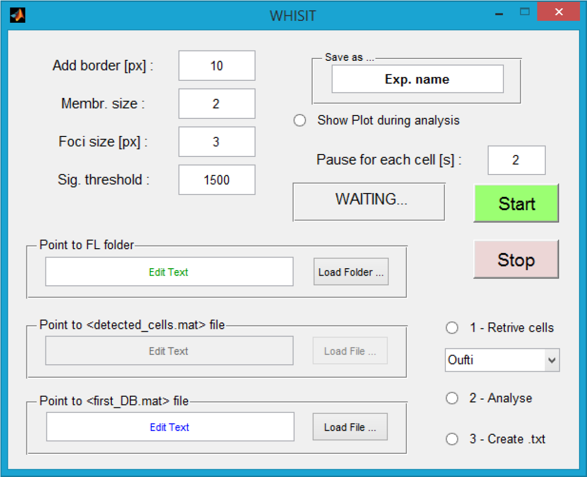

# Memb_2_Cyto

<u>**see the *Manual WHISIT.pdf* file for a guide of the program and how to use it.**</u>

[***WHISIT***](https://github.com/sanger-matteo/WHISIT) is an improve version of *Memb_2_Cyto* and with additional functionality.

## Purpose
***Memb_2_Cyto*** is a Matlab-based program developed to identify bacteria and measures the fluorescent signal in different compartments. It can do this on a set of independent microscopy pictures. It perform high-throughput quantification of fluorescent signal, specifically in into different areas of cells (e.g., membrane, cytosolic and polar compartments), rather than simply giving the average intensity value (as it is done by most software).
Results are created in a user friendly format accessible via Excel or any other similar spread-sheet program. 

|  
| --- |
| Figure 1 – Overview of the GUI of Memb_2_Cyto |

*Memb_2_Cyto* works side-by-side and uses the “detection” output file generated by either MicrobeTracker or Oufti: 
- **MicrobeTracker** (http://microbetracker.org/, Sliusarenko, O. et al., 2011)  
- **Oufti** (http://oufti.org/index.html, Paintdakhi, A. et al., 2016). 
Both programs are Matlab-based and their core algorithm take stacks of bright field images and identify the bacteria perimeters in each single picture. These programs yields output files that contains sets of coordinates for each cell perimeter. These are used by *Memb_2_Cyto* to identify cells and analyse fluorescent signal distribution.
*Oufti* is the upgraded version of *MicrobeTracker* and therefore its use is recommended. 

